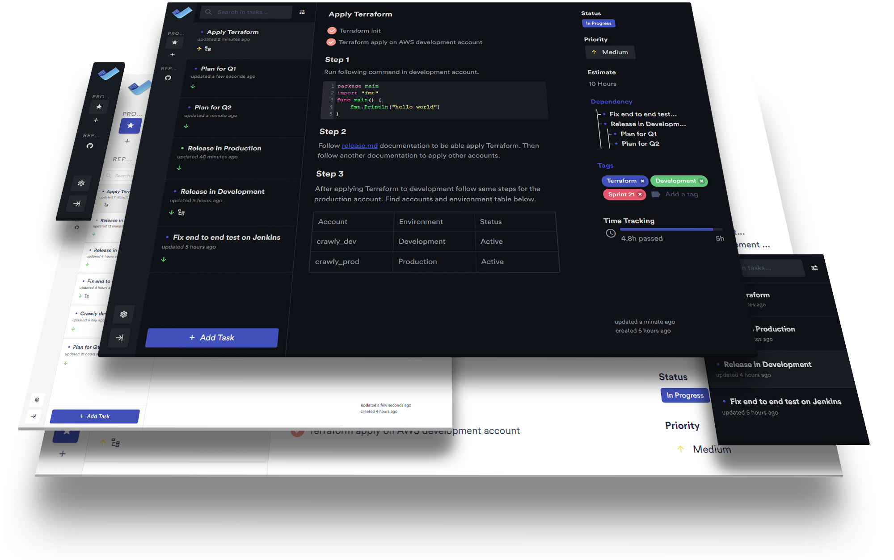

# Dev Tools

A free and open source task management tool for developers.

<p align="center">
    
</p>
<p align="center">
    
    
    
    
</p>
<p align="center">
    
    <br>  
    <strong>Built with Electron and Vue.</strong>
</p>

## Supporting

**Dev Tasks** is open source project and completely free to use.

However, the amount of effort needed to maintain and develop new features for the project is not sustainable without
proper financial backing. You can support Dev Tasks development via the following methods:

SOON

## Overview

SOON

## Development

```bash
# install dependencies
yarn
# serve with hot reload
yarn run dev
```

## Building

```bash
## build application for production
yarn run build
```

## License

[AGPL-3.0](https://github.com/omegion/dev-tasks/blob/master/LICENSE)

